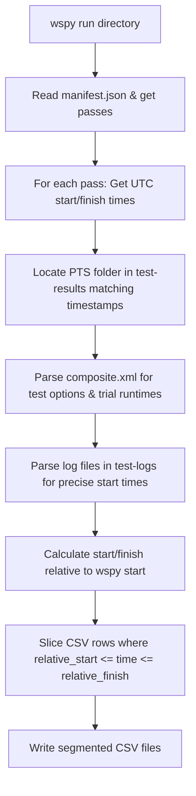

# Phoronix Test Suite Instrumentation Investigation

This report investigates mapping Phoronix Test Suite (PTS) runs to `wspy` telemetry. 

Specifically, we address how to segment telemetry datasets (e.g., performance counters, power, system metrics) into individual test cases and trial runs, **without** relying on heavy ptrace-based process tree tracing. This allows the segmentation to work across any run profile (such as `deep-cpu` or custom counter sweeps) where ptrace is not active or feasible.

---

## Executive Summary
We have successfully developed a **Metadata-Log Correlation** method that partitions `wspy` telemetry CSV files into per-test-case datasets. This method is completely non-intrusive, has zero run-time overhead, and works universally across all `wspy` passes (including hardware counter sweeps). 

Additionally, we discovered a first-class hook mechanism built into PTS itself: the **`result_notifier`** module. By leveraging this module, PTS can execute user hook scripts immediately before and after every individual trial run, passing precise test metadata (including the exact comparison hash, run number, and arguments) directly in environment variables.

---

## 1. Anatomy of Phoronix Run Timestamps
During any run, both `wspy` and PTS log timestamps from the system wall clock:

1. **`wspy` Manifest**:
   Every pass (e.g., `counters`, `systemtime`, `power`) writes its own manifest (e.g., `counters.manifest.json`) containing precise UTC start and finish timestamps:
   ```json
   "timing": {
     "start_time": "2026-07-18T13:06:30.998Z",
     "finish_time": "2026-07-18T13:08:52.360Z"
   }
   ```

2. **PTS Trial Logs**:
   PTS runs each test option (e.g., `SHA256`, `Coremark`) sequentially and writes trial execution logs inside:
   `~/.phoronix-test-suite/test-results/<results-id>/test-logs/<hash>/<results-id>.log`
   
   Each trial run prints its precise start time inside the log file:
   ```text
   #####
   2026-07-18 13:06 - Run 1
   2026-07-18 13:06:50
   #####
   ```

3. **PTS Composite XML**:
   The `composite.xml` file generated in the results folder records the exact measured runtime (duration) of each trial run:
   ```xml
   <JSON>{"compiler-options":..., "test-run-times":"42.7:42.2:42.3"}</JSON>
   ```

---

## 2. Correlation and Slicing Algorithm
By reading these files, we map trial runs directly to elapsed-time rows in `wspy`'s CSVs:



For example, given:
* `wspy` Pass Start ($T_{start}$): `13:06:30.998`
* PTS Trial Run 1 Start ($t_{start}$): `13:06:50` (relative start: `19.0s`)
* Trial Duration ($d$): `42.7s` (relative finish: `61.7s`)

Any telemetry row in `power.csv` (or any other CSV) where `19.0 <= time <= 61.7` belongs to this specific test trial.

---

## 3. The Segmentation Utility
The script [wspy-phoronix-segment.py](file:///home/mev/source/wspy/scripts/wspy-phoronix-segment.py) automates this pipeline.

### Execution Example:
```bash
python3 scripts/wspy-phoronix-segment.py --rundir web/runs/phoronix/coremark/20260718T130628.995-2dc78854
```

### Output:
```text
Analyzing run directory: /home/mev/source/wspy/web/runs/phoronix/coremark/20260718T130628.995-2dc78854
Suite: phoronix, Benchmark: coremark

--- Pass: power ---
  Time Window: 2026-07-18T13:06:30.998000+00:00 to 2026-07-18T13:08:52.360000+00:00
  Matched Phoronix results directory: /home/mev/.phoronix-test-suite/test-results/2026-07-18-1306
  Processing telemetry CSV: power.csv
    Sliced: coremark_size_666___iterations_per_second_run1_power.csv [49.0s to 91.7s]
    Sliced: coremark_size_666___iterations_per_second_run2_power.csv [95.0s to 137.2s]
    Sliced: coremark_size_666___iterations_per_second_run3_power.csv [139.0s to 181.3s]
  Successfully segmented power.csv into 3 test-case files.
```

---

## 4. Built-in Phoronix Hooks (`result_notifier`)
Phoronix Test Suite has a built-in module called **`result_notifier`** (located at `/usr/share/phoronix-test-suite/pts-core/modules/result_notifier.php`) designed to trigger external scripts at key points in the execution lifecycle.

### Setup Instructions
1. **Enable the Module**:
   Edit `~/.phoronix-test-suite/user-config.xml` and append `result_notifier` to the `<AutoLoadModules>` list:
   ```xml
   <AutoLoadModules>toggle_screensaver, update_checker, result_notifier</AutoLoadModules>
   ```
2. **Define Hook Scripts**:
   Run `phoronix-test-suite module-setup result_notifier` and input the paths to your custom hook scripts:
   - **`pre_test_run_process`**: Script executed immediately before each trial run starts.
   - **`post_test_run_process`**: Script executed immediately after each trial run exits.
   *(Alternatively, configure these elements directly inside `~/.phoronix-test-suite/user-config.xml`)*

### Environment Context passed to Hooks
Every time PTS calls your hook scripts, it populates the process environment with rich metadata:

| Environment Variable | Description / Example |
| :--- | :--- |
| `PTS_EXTERNAL_TEST_IDENTIFIER` | The test identifier (e.g. `pts/openssl-4.0.0`) |
| `PTS_EXTERNAL_TEST_ARGS` | Arguments passed to benchmark wrapper (e.g. `sha256`) |
| `PTS_EXTERNAL_TEST_DESCRIPTION` | Human-readable option description (e.g. `Algorithm: SHA256`) |
| `PTS_EXTERNAL_TEST_RUN_POSITION` | Current trial run index (e.g. `1`) |
| `PTS_EXTERNAL_TEST_RUN_COUNT` | Total trial runs scheduled (e.g. `3`) |
| `PTS_EXTERNAL_TEST_HASH` | Scale-free comparison hex hash (e.g. `30bbdb7317e00ac3ec7cabaf58ca2a527beed28e`) |

### How to exploit this with `wspy`:
By placing simple logger hooks in these positions, we can log sub-millisecond precision start and end timestamps directly:
* **`pre-test-run-hook`**:
  ```bash
  echo "$(date -u +%s.%N) START ${PTS_EXTERNAL_TEST_HASH} ${PTS_EXTERNAL_TEST_RUN_POSITION}" >> /tmp/wspy_pts_current_run.log
  ```
* **`post-test-run-hook`**:
  ```bash
  echo "$(date -u +%s.%N) FINISH ${PTS_EXTERNAL_TEST_HASH} ${PTS_EXTERNAL_TEST_RUN_POSITION}" >> /tmp/wspy_pts_current_run.log
  ```
The segmenting tool can then read this high-precision log file to slice the main telemetry CSV, entirely eliminating the need to parse raw `.log` outputs or query `composite.xml`.

---

## 5. Brainstorming Integration Strategies
We brainstormed three distinct architectures to utilize the PTS `result_notifier` hooks with `wspy`:

### Strategy A: Post-Run Partitioning via Hook-Generated Timestamps
The pre/post hooks log high-precision timestamps to a text file (exactly as shown in Section 4). `wspy` runs as a single monolithic process wrapping the entire PTS suite run. Post-processing tools slice the CSV telemetry after execution.

* **Pros**:
  * **Score Integrity (Critical)**: Writing to a log file takes less than 1ms. There is zero profiling noise introduced during execution, ensuring benchmark scores stay accurate.
  * **Extremely Simple**: No complex IPC, sockets, or process synchronization required.
  * **Multi-pass Compatibility**: Seamlessly splits data for all passes.
* **Cons**:
  * Segmentation is deferred until the entire test run finishes.

### Strategy B: Real-time Checkpointing via IPC to `wspy`
`wspy` wraps the entire PTS command. The pre/post hooks send IPC signals (e.g. Unix sockets, named FIFOs, or `SIGUSR1`/`SIGUSR2`) to the running parent `wspy` process. On reception, `wspy` appends checkpoint markers or starts a new phase index directly in the CSV.

* **Pros**:
  * **Real-time segmentation**: The output CSV file is partitioned dynamically as it is written.
  * **Centralized Logic**: Telemetry collection is managed by a single coordinated coordinator.
* **Cons**:
  * **IPC Overhead & Complexity**: Requires adding signal handling, FIFO listeners, or socket polling into `wspy.c` / `topdown.c`.
  * **Jitter**: Inter-process communication can introduce slight timing overhead immediately before benchmark starts.

### Strategy C: Hook-Initiated Separate `wspy` Invocations
PTS runs standalone (no wrapping at the top level). The `pre_test_run` hook launches a new, separate `wspy` instance in the background targeting the workload's PID. The `post_test_run` hook terminates it.

* **Pros**:
  * **Dynamic Configurations**: Because hooks run per test-case, the pre-hook can select different counter configurations tailored to the specific test (e.g. memory counters for sysbench RAM, CPU/cache counters for Coremark).
  * **True Isolation**: Separate output files are created naturally.
* **Cons**:
  * **PID Racing**: The pre-test hook executes *before* PTS spawns the actual benchmark workload. Capturing the correct target benchmark PID is prone to racing conditions.
  * **Benchmarking Overhead**: Initializing PMU counters, writing sysfs files, and starting threads immediately prior to execution introduces significant overhead and timing jitter.
  * **Incompatible with Native Multi-pass**: Cannot run multiple counter passes natively.

---

## 6. Temporal Resolution and Handling of Gaps

When evaluating Strategy A, two operational questions arise regarding timestamp resolution and intermediate idle periods:

### 1. Granularity & Second-Type Boundaries
Currently, `wspy`'s periodic telemetry collection is constrained to integer seconds:
* The `interval` variable is defined as an `int` in [wspy.c:L42](file:///home/mev/source/wspy/wspy.c#L42).
* The periodic sampling trigger is powered by `alarm(interval)` in [wspy.c:L1459](file:///home/mev/source/wspy/wspy.c#L1459) which only supports whole seconds.

**Impact on Average Metrics**:
For standard benchmark runs (spanning 30 to 180 seconds), a 1-second boundary alignment error has a **statistically negligible impact** ($<1\%$) on time-integrated metrics (e.g., average IPC, cache miss rates, or mean package power). If sub-second granularity (such as 100ms or 10ms ticks) is ever required, `wspy`'s timer system can be easily refactored to use `setitimer()` or `timerfd_create()` alongside a float-based interval.

### 2. Handling PTS Gaps (Cool-down / Compilation / Metadata Extraction)
PTS runs often include significant idle gaps between tests to allow components to cool down or prepare. 

**Impact**:
* **Without segmentation**: These gaps heavily pollute the aggregate metrics, pulling down average power draw and diluting IPC measurements.
* **With Strategy A**: **Gaps are completely discarded**. Since the slicing algorithm cuts only the active windows matching `[elapsed_start, elapsed_finish]`, the idle time data is thrown away, ensuring the per-run metrics remain clean and uncontaminated.
