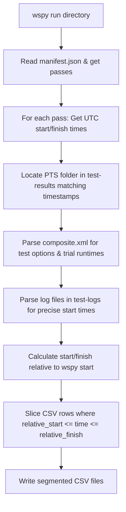

# Phoronix Test Suite Instrumentation Investigation

This report investigates mapping Phoronix Test Suite (PTS) runs to `wspy` telemetry. 

Specifically, we address how to segment telemetry datasets (e.g., performance counters, power, system metrics) into individual test cases and trial runs, **without** relying on heavy ptrace-based process tree tracing. This allows the segmentation to work across any run profile (such as `deep-cpu` or custom counter sweeps) where ptrace is not active or feasible.

---

## Executive Summary
We have successfully developed a **Metadata-Log Correlation** method that partitions `wspy` telemetry CSV files into per-test-case datasets. This method is completely non-intrusive, has zero run-time overhead, and works universally across all `wspy` passes (including hardware counter sweeps). 

Additionally, we discovered a first-class hook mechanism built into PTS itself: the **`result_notifier`** module. By leveraging this module, PTS can execute user hook scripts immediately before and after every individual trial run, passing precise test metadata (including the exact comparison hash, run number, and arguments) directly in environment variables.

---

## 1. Anatomy of Phoronix Run Timestamps
During any run, both `wspy` and PTS log timestamps from the system wall clock:

1. **`wspy` Manifest**:
   Every pass (e.g., `counters`, `systemtime`, `power`) writes its own manifest (e.g., `counters.manifest.json`) containing precise UTC start and finish timestamps:
   ```json
   "timing": {
     "start_time": "2026-07-18T13:06:30.998Z",
     "finish_time": "2026-07-18T13:08:52.360Z"
   }
   ```

2. **PTS Trial Logs**:
   PTS runs each test option (e.g., `SHA256`, `Coremark`) sequentially and writes trial execution logs inside:
   `~/.phoronix-test-suite/test-results/<results-id>/test-logs/<hash>/<results-id>.log`
   
   Each trial run prints its precise start time inside the log file:
   ```text
   #####
   2026-07-18 13:06 - Run 1
   2026-07-18 13:06:50
   #####
   ```

3. **PTS Composite XML**:
   The `composite.xml` file generated in the results folder records the exact measured runtime (duration) of each trial run:
   ```xml
   <JSON>{"compiler-options":..., "test-run-times":"42.7:42.2:42.3"}</JSON>
   ```

---

## 2. Correlation and Slicing Algorithm
By reading these files, we map trial runs directly to elapsed-time rows in `wspy`'s CSVs:



For example, given:
* `wspy` Pass Start ($T_{start}$): `13:06:30.998`
* PTS Trial Run 1 Start ($t_{start}$): `13:06:50` (relative start: `19.0s`)
* Trial Duration ($d$): `42.7s` (relative finish: `61.7s`)

Any telemetry row in `power.csv` (or any other CSV) where `19.0 <= time <= 61.7` belongs to this specific test trial.

---

## 3. The Segmentation Utility
The script [wspy-phoronix-segment.py](file:///home/mev/source/wspy/scripts/wspy-phoronix-segment.py) automates this pipeline.

### Execution Example:
```bash
python3 scripts/wspy-phoronix-segment.py --rundir web/runs/phoronix/coremark/20260718T130628.995-2dc78854
```

### Output:
```text
Analyzing run directory: /home/mev/source/wspy/web/runs/phoronix/coremark/20260718T130628.995-2dc78854
Suite: phoronix, Benchmark: coremark

--- Pass: power ---
  Time Window: 2026-07-18T13:06:30.998000+00:00 to 2026-07-18T13:08:52.360000+00:00
  Matched Phoronix results directory: /home/mev/.phoronix-test-suite/test-results/2026-07-18-1306
  Processing telemetry CSV: power.csv
    Sliced: coremark_size_666___iterations_per_second_run1_power.csv [49.0s to 91.7s]
    Sliced: coremark_size_666___iterations_per_second_run2_power.csv [95.0s to 137.2s]
    Sliced: coremark_size_666___iterations_per_second_run3_power.csv [139.0s to 181.3s]
  Successfully segmented power.csv into 3 test-case files.
```

---

## 4. Built-in Phoronix Hooks (`result_notifier`)
Phoronix Test Suite has a built-in module called **`result_notifier`** (located at `/usr/share/phoronix-test-suite/pts-core/modules/result_notifier.php`) designed to trigger external scripts at key points in the execution lifecycle.

### Setup Instructions
1. **Enable the Module**:
   Edit `~/.phoronix-test-suite/user-config.xml` and append `result_notifier` to the `<AutoLoadModules>` list:
   ```xml
   <AutoLoadModules>toggle_screensaver, update_checker, result_notifier</AutoLoadModules>
   ```
2. **Define Hook Scripts**:
   Run `phoronix-test-suite module-setup result_notifier` and input the paths to your custom hook scripts:
   - **`pre_test_run_process`**: Script executed immediately before each trial run starts.
   - **`post_test_run_process`**: Script executed immediately after each trial run exits.
   *(Alternatively, configure these elements directly inside `~/.phoronix-test-suite/user-config.xml`)*

### Environment Context passed to Hooks
Every time PTS calls your hook scripts, it populates the process environment with rich metadata:

| Environment Variable | Description / Example |
| :--- | :--- |
| `PTS_EXTERNAL_TEST_IDENTIFIER` | The test identifier (e.g. `pts/openssl-4.0.0`) |
| `PTS_EXTERNAL_TEST_ARGS` | Arguments passed to benchmark wrapper (e.g. `sha256`) |
| `PTS_EXTERNAL_TEST_DESCRIPTION` | Human-readable option description (e.g. `Algorithm: SHA256`) |
| `PTS_EXTERNAL_TEST_RUN_POSITION` | Current trial run index (e.g. `1`) |
| `PTS_EXTERNAL_TEST_RUN_COUNT` | Total trial runs scheduled (e.g. `3`) |
| `PTS_EXTERNAL_TEST_HASH` | Scale-free comparison hex hash (e.g. `30bbdb7317e00ac3ec7cabaf58ca2a527beed28e`) |

### How to exploit this with `wspy`:
By placing simple logger hooks in these positions, we can log sub-millisecond precision start and end timestamps directly:
* **`pre-test-run-hook`**:
  ```bash
  echo "$(date -u +%s.%N) START ${PTS_EXTERNAL_TEST_HASH} ${PTS_EXTERNAL_TEST_RUN_POSITION}" >> /tmp/wspy_pts_current_run.log
  ```
* **`post-test-run-hook`**:
  ```bash
  echo "$(date -u +%s.%N) FINISH ${PTS_EXTERNAL_TEST_HASH} ${PTS_EXTERNAL_TEST_RUN_POSITION}" >> /tmp/wspy_pts_current_run.log
  ```
The segmenting tool can then read this high-precision log file to slice the main telemetry CSV, entirely eliminating the need to parse raw `.log` outputs or query `composite.xml`.

---

## 5. Brainstorming Integration Strategies
We brainstormed three distinct architectures to utilize the PTS `result_notifier` hooks with `wspy`:

### Strategy A: Post-Run Partitioning via Hook-Generated Timestamps
The pre/post hooks log high-precision timestamps to a text file (exactly as shown in Section 4). `wspy` runs as a single monolithic process wrapping the entire PTS suite run. Post-processing tools slice the CSV telemetry after execution.

* **Pros**:
  * **Score Integrity (Critical)**: Writing to a log file takes less than 1ms. There is zero profiling noise introduced during execution, ensuring benchmark scores stay accurate.
  * **Extremely Simple**: No complex IPC, sockets, or process synchronization required.
  * **Multi-pass Compatibility**: Seamlessly splits data for all passes.
* **Cons**:
  * Segmentation is deferred until the entire test run finishes.

### Strategy B: Real-time Checkpointing via IPC to `wspy`
`wspy` wraps the entire PTS command. The pre/post hooks send IPC signals (e.g. Unix sockets, named FIFOs, or `SIGUSR1`/`SIGUSR2`) to the running parent `wspy` process. On reception, `wspy` appends checkpoint markers or starts a new phase index directly in the CSV.

* **Pros**:
  * **Real-time segmentation**: The output CSV file is partitioned dynamically as it is written.
  * **Centralized Logic**: Telemetry collection is managed by a single coordinated coordinator.
* **Cons**:
  * **IPC Overhead & Complexity**: Requires adding signal handling, FIFO listeners, or socket polling into `wspy.c` / `topdown.c`.
  * **Jitter**: Inter-process communication can introduce slight timing overhead immediately before benchmark starts.

### Strategy C: Hook-Initiated Separate `wspy` Invocations
PTS runs standalone (no wrapping at the top level). The `pre_test_run` hook launches a new, separate `wspy` instance in the background targeting the workload's PID. The `post_test_run` hook terminates it.

* **Pros**:
  * **Dynamic Configurations**: Because hooks run per test-case, the pre-hook can select different counter configurations tailored to the specific test (e.g. memory counters for sysbench RAM, CPU/cache counters for Coremark).
  * **True Isolation**: Separate output files are created naturally.
* **Cons**:
  * **PID Racing**: The pre-test hook executes *before* PTS spawns the actual benchmark workload. Capturing the correct target benchmark PID is prone to racing conditions.
  * **Benchmarking Overhead**: Initializing PMU counters, writing sysfs files, and starting threads immediately prior to execution introduces significant overhead and timing jitter.
  * **Incompatible with Native Multi-pass**: Cannot run multiple counter passes natively.

---

## 6. Temporal Resolution and Handling of Gaps

When evaluating Strategy A, two operational questions arise regarding timestamp resolution and intermediate idle periods:

### 1. Granularity & Second-Type Boundaries
Currently, `wspy`'s periodic telemetry collection is constrained to integer seconds:
* The `interval` variable is defined as an `int` in [wspy.c:L42](file:///home/mev/source/wspy/wspy.c#L42).
* The periodic sampling trigger is powered by `alarm(interval)` in [wspy.c:L1459](file:///home/mev/source/wspy/wspy.c#L1459) which only supports whole seconds.

**Impact on Average Metrics**:
For standard benchmark runs (spanning 30 to 180 seconds), a 1-second boundary alignment error has a **statistically negligible impact** ($<1\%$) on time-integrated metrics (e.g., average IPC, cache miss rates, or mean package power). If sub-second granularity (such as 100ms or 10ms ticks) is ever required, `wspy`'s timer system can be easily refactored to use `setitimer()` or `timerfd_create()` alongside a float-based interval.

### 2. Handling PTS Gaps (Cool-down / Compilation / Metadata Extraction)
PTS runs often include significant idle gaps between tests to allow components to cool down or prepare. 

**Impact**:
* **Without segmentation**: These gaps heavily pollute the aggregate metrics, pulling down average power draw and diluting IPC measurements.
* **With Strategy A**: **Gaps are completely discarded**. Since the slicing algorithm cuts only the active windows matching `[elapsed_start, elapsed_finish]`, the idle time data is thrown away, ensuring the per-run metrics remain clean and uncontaminated.

---

## 7. Implementation Update (2026-07-19): Hook Capture Landed, Environment Assumption Corrected

Section 4's "How to exploit this with `wspy`" sketch assumed a hook script could reach further context
(e.g. by reading environment inherited from whatever launched `phoronix-test-suite`) beyond the
`PTS_EXTERNAL_TEST_*` variables it documented. **Verified against the actual installed module**
(`/usr/share/phoronix-test-suite/pts-core/modules/result_notifier.php`, not just its own setup-comment
header) that this is not the case: every hook is launched via PHP's
`proc_open($cmd_value, $descriptor_spec, $pipes, null, $env_vars)`, and `$env_vars` there is a small
array built fresh from the `pts_test_result`/`pts_test_run_manager` object being processed — per PHP's
own `proc_open()` semantics, passing a non-null `env_vars` argument **replaces** the child process's
environment rather than extending it. A hook script therefore only ever sees the documented
`PTS_EXTERNAL_TEST_*` variables (confirmed exhaustively from the module source: `PTS_EXTERNAL_TEST_HOOK`,
and for the per-trial hooks `_IDENTIFIER`/`_RUN_POSITION`/`_RUN_COUNT`/`_ARGS`/`_DESCRIPTION`/
`_RESULT_SET`/`_RESULT`/`_HASH`/`_STD_DEV_PERCENT`/optionally `_CACHE_SHARE`) — nothing exported by
`wspy`/`wspy-run`/the shell that originally launched `phoronix-test-suite` reaches it. This rules out
pointing a hook at "the current wspy run directory" via inherited environment; the checkpoint log must
be written to a fixed, well-known path instead, with relocation into the run directory happening as a
separate step once the whole `phoronix-test-suite` invocation (and therefore `wspy`) has exited.

Also verified: hook registration lives in **two separate files**, not just `user-config.xml` as Section
4 implied — `~/.phoronix-test-suite/modules-data/result_notifier/module-settings.ini` (a plain
`key=value` file, written by `pts_module::module_config_save()`, non-destructively merged with any
existing entries) holds which script runs for each hook point; `user-config.xml`'s
`<Modules><AutoLoadModules>` list separately controls whether the module loads automatically at all.
Both need to be set for the hooks to actually fire on a normal `phoronix-test-suite` invocation. **The
directory must be the underscored `result_notifier`**, matching the module's literal PHP class name —
`scripts/setup_phoronix_hooks.sh` originally wrote a hyphenated `result-notifier` directory instead
(fixed 2026-07-19, see Section 9 below), which PTS's own `pts_module::read_option()` silently never
reads: registration appeared to succeed but the hooks never actually fired, on any host that had run the
original version of that script.

**What's landed** (Strategy A, corrected for the above): `scripts/pts_hooks/pre_test_run.sh` and
`post_test_run.sh` log a `START`/`FINISH` TSV line (timestamp, hash, run position/count, test
identifier/args, plus result/stddev on `FINISH`) to a fixed staging path
(`${WSPY_PTS_HOOK_LOG:-/tmp/wspy_pts_hooks.log}`) on every hook invocation.
`workload/phoronix/run_test.sh` — the actual script this project's real Phoronix runs go through —
computes its unified run directory up front (previously only computed inside the non-Intel branch, after
the `wspy-run` call), archives any stale leftover staging file from an interrupted earlier run before
starting (rather than silently misattributing it), and relocates the staging file into
`<rundir>/pts_hooks.log` once `wspy-run` returns — a no-op, not a failure, on a host where the hooks
aren't registered, same measured-vs-unavailable idiom used throughout this codebase.
`scripts/setup_phoronix_hooks.sh` is the one-time registration helper (mirrors `setup_perf.sh`'s
check-then-prompt shape: reports current vs. desired state for both files above, applies only on
per-change confirmation or `-y`) — not run automatically against any real host by this change, since it
edits a user's actual Phoronix Test Suite installation state, not this repository. Verified end-to-end
with fake `wspy-run`/hook-invocation harnesses (normal capture-and-relocate path, and the stale-leftover
path) and, separately, the registration helper's write logic against a sandboxed `PTS_USER_PATH`
(preserves unrelated existing `module-settings.ini` keys, idempotent re-run, correct `AutoLoadModules`
XML surgery) — no real host's `~/.phoronix-test-suite` was modified during this validation.

**What's still open** (the actual remainder of 4.3 Tier 6 item 20): nothing yet consumes
`pts_hooks.log` — `scripts/wspy-phoronix-segment.py` still only implements the composite.xml/test-log
timestamp-correlation approach from Sections 1-3. Teaching it to prefer `pts_hooks.log` when present
(higher precision, no composite.xml hash-mapping indirection needed since the log already carries the
test identifier/args directly) is the next real step, once hooks have been registered on at least one
host and produced real data to validate the format against.

## 8. Follow-up (2026-07-19): Relocation Moved From `run_test.sh` Into `wspy-run` Itself

Registering the hooks on a real host (`scripts/setup_phoronix_hooks.sh`) surfaced a gap Section 7 didn't
anticipate: real Phoronix runs on this host go through several different front ends (`workload/phoronix/
run_test.sh`, the web launcher's `wspy-run`-backed preset path via `web/joblib.py`'s
`execute_profile_run()`, `wspy-queue`'s preset jobs), and Section 7's relocation step lived only in
`run_test.sh`. Every run actually launched through one of the other front ends silently lost its hook
capture — `/tmp/wspy_pts_hooks.log` accumulated events but nothing ever relocated it into a run
directory, and (being under `/tmp`) it didn't even persist for later manual recovery.

The relocation now lives in `wspy-run`'s own `run_pass()`, the one place every front end above already
funnels through, instead of in any one caller:

- Before each pass runs, a non-empty staging file is archived aside (`.stale-$$`) rather than attributed
  to the upcoming pass — necessary now in a way it wasn't when relocation happened only once at the very
  end of a whole `run_test.sh` invocation: `wspy-run`'s builtin profiles are multi-pass (e.g. `deep-cpu`
  is three separate `wspy` invocations, each a full re-execution of `phoronix-test-suite batch-run
  <test>`), so the hooks — if registered — fire again on every pass. Relocating only once at the end
  would otherwise merge every pass's `START`/`FINISH` lines into one undifferentiated blob with no way
  to tell which pass a given trial run belonged to.
- After each pass, a non-empty staging file is relocated to `<pass-name>.pts_hooks.log` next to that
  pass's own output/manifest (unified layout: `<rundir>/<pass-name>.pts_hooks.log`; flat mode:
  `<outdir>/<prefix><pass-name>.pts_hooks.log`), and recorded in the run-level `manifest.json`'s
  `passes[]` entry as `"pts_hooks_log"` (`null` when absent, same convention as the existing `"manifest"`
  field).
- `run_test.sh` no longer does any of its own staging/relocation — it now gets `pts_hooks.log` artifacts
  the same way every other front end does, entirely as a side effect of calling `wspy-run`.

Verified against a fake PTS stand-in script (writes `START`/`FINISH` lines to `$WSPY_PTS_HOOK_LOG` when
invoked, like the real hooks would) driven through a real two-pass `wspy-run -c <config>` invocation:
each pass produced its own distinct `<pass-name>.pts_hooks.log` with no cross-pass contamination, the
staging path was empty again after each pass, and a workload that never touches the hooks at all (hooks
not registered, or a non-Phoronix command) produces no `pts_hooks.log` files and `"pts_hooks_log": null`
in the manifest, same measured-vs-unavailable degradation as before.

**Update (same day):** the web launcher's *custom checklist* run path (`web/joblib.py`'s
`execute_custom_run()`) is now covered too, via a Python-side equivalent of the same two steps
(`_archive_stale_pts_hooks_log()`/`_capture_pts_hooks_log()`, `web/joblib.py`) rather than folding that
path onto `wspy-run` itself (it deliberately invokes `wspy` directly per configuration, not `wspy-run` --
see `build_configuration_passes()`'s own docstring). Applied at both places in `joblib.py` that launch a
plain `wspy` subprocess directly: `execute_custom_run()`'s per-configuration passes, and
`execute_profile_run()`'s supplementary plot-data passes (extra `wspy` invocations run after a preset's
own `wspy-run` call, to collect a column a custom plot needs that the preset's own passes don't produce --
the same "invokes `wspy` directly, not through `wspy-run`" shape as the custom-checklist path). Each
custom-mode pass's capture is recorded as `"pts_hooks_log"` in `write_custom_run_manifest()`'s
`manifest.json`, identical field name/shape to `wspy-run`'s own; a supplementary pass's capture isn't
recorded anywhere (`manifest.json` there is `wspy-run`'s own document, which knows nothing about
supplementary passes), but still lands in the run directory and is picked up by the report's existing
"Other artifacts" scan like any other unclaimed file. Verified with the same fake-PTS-hook-firing-script approach as the `wspy-run`
follow-up above, driven through a real `execute_custom_run()` call: captured correctly to
`<pass-name>.pts_hooks.log`, recorded in `manifest.json`, and the staging path cleared afterward.

With this, every real launch path in the codebase (`workload/phoronix/run_test.sh`, the web launcher's
preset path, the web launcher's custom checklist path, `wspy-queue`'s preset and custom-checklist jobs)
captures Phoronix hook data the same way, regardless of which one runs a given Phoronix workload.

## 9. Real-Host Findings (2026-07-19): Registration Never Actually Worked, Plus an Upstream PTS Bug

Registering the hooks on a real host (`scripts/setup_phoronix_hooks.sh`, confirmed present in
`user-config.xml`'s `<AutoLoadModules>` and in `module-settings.ini`) still produced **zero** hook
capture on a real `wspy-run`-launched `coremark` run — `manifest.json`'s `pts_hooks_log` fields all read
`null`, and no staging file was ever created at `/tmp/wspy_pts_hooks.log`, despite `phoronix-test-suite`'s
own startup banner confirming "The result_notifier module for providing external hooks has been loaded."
Root-caused via direct inspection of the installed PTS source
(`pts-core/objects/client/pts_module.php`, `pts-core/modules/result_notifier.php`), to two separate,
compounding bugs:

**Bug 1 (ours, now fixed): wrong module-data directory name.** `scripts/setup_phoronix_hooks.sh` wrote
`module-settings.ini` under `~/.phoronix-test-suite/modules-data/result-notifier/` (hyphenated).
`pts_module::read_option()` resolves the directory from the *literal PHP class name* of the currently
executing module — `result_notifier` (underscored, matching `class result_notifier extends
pts_module_interface`) — via `pts_module_manager::get_current_module()`. A hyphenated directory is simply
never read: `read_option()` silently returns empty, `process_user_config_external_hook_process()`'s outer
`!empty($cmd_value)` check fails, and the hook is never invoked at all — no error, no crash, just quiet
no-op. This is why "no evidence of the hooks" was the only symptom; nothing was actually broken loudly.
Fixed in `scripts/setup_phoronix_hooks.sh` (and this doc's Section 7 reference above) to use the
underscored `modules-data/result_notifier/` directory. A host that ran the old buggy version of this
script has a stale, harmless `modules-data/result-notifier/` directory sitting unread on disk — safe to
leave or remove by hand, PTS never looks at it either way.

**Bug 2 (upstream, not ours): `result_notifier.php` itself crashes as soon as bug 1 is fixed.** With the
directory name corrected and a real hook script configured, live testing against `phoronix-test-suite`
v10.8.6 (PHP 8.3, real `pts/coremark-1.0.1` runs) reproduced an uncaught PHP fatal error consistently:

- With `pre_test_run_process` configured: `Call to a member function get_count() on null` in
  `result_notifier.php`, thrown on the very first `__pre_test_run` call, before any trial even starts —
  the whole `phoronix-test-suite` process dies with zero results.
- With only `post_test_run_process` configured (no pre-hook): all 3 trials complete and the result
  average is computed normally, then the *same* fatal error is thrown at `__post_test_run` time.

Root cause (both hit the same underlying pattern): `process_user_config_external_hook_process()`
unconditionally dereferences `$passed_obj->test_result_buffer` (null both pre-run, since no trial has
happened yet, and — for a simple single-way test like `coremark` — even post-run, since only entries
under `generated_result_buffers` necessarily get their own `test_result_buffer` populated, not the
request object itself) and calls `$passed_obj->get_result()` (a method that doesn't exist on
`pts_test_result` at all — the real accessor is `$passed_obj->active->get_result()`,
`pts_test_result_buffer_active`, which `pts_test_execution.php` itself uses directly elsewhere). Since
either bug alone is a fatal, uncatchable PHP error, this code path can never have run to completion
against a real hook script before — plausibly why neither has been noticed since the module's 2010–2011
copyright, given this is a rarely-used, purely-optional feature.

**This means the whole hook-capture approach (Sections 4–8 above) was non-functional against this PTS
version the entire time**, independent of and prior to any of this project's own wiring work — not a
wspy-side regression, a pre-existing incompatibility that registering the hooks correctly (bug 1's fix)
would have newly *exposed* as a crash rather than newly caused.

**Fix, filed upstream:** a minimal patch guarding both accesses (`instanceof` checks, degrading to sane
defaults — run position 1, empty result set, result/stddev 0 — when the data isn't populated yet, the
same "check before use" idiom this module already applies elsewhere) is up as
[phoronix-test-suite/phoronix-test-suite#924](https://github.com/phoronix-test-suite/phoronix-test-suite/pull/924),
with [#925](https://github.com/phoronix-test-suite/phoronix-test-suite/issues/925) as the companion bug
report. Verified live end-to-end with the patch applied: all 3 coremark trials complete, both hooks fire
without error, and the configured script receives real `START`/`FINISH` lines with the documented
`PTS_EXTERNAL_TEST_*` fields populated (hash, run position, run count, test identifier).

**Practical implication for this project, until upstream merges/releases:** registering the hooks
(`scripts/setup_phoronix_hooks.sh`, now pointing at the correct directory) on a host running an unpatched
PTS will make real Phoronix benchmark runs crash with zero results the moment the hooks actually fire —
substantially worse than today's silent no-op. `setup_phoronix_hooks.sh` deliberately still does *not*
detect or guard against this on its own (that would mean parsing/patching a vendored PHP file from a bash
script, well outside this project's scope) — registering the hooks on any given host remains a manual,
informed choice, same as it always was, just now actually consequential rather than inert. A host that
wants the hooks working before an upstream release can apply the same patch locally to its own installed
`/usr/share/phoronix-test-suite/pts-core/modules/result_notifier.php` (or wherever the local install
lives) — this is exactly what was done and verified on this project's own development host, and reverted
back to the stock file afterward pending the upstream fix landing for real.

One more discovered nuance, independent of either bug above: `__pre_test_run`/`__post_test_run` fire
**once per test option** (i.e. once per `phoronix-test-suite batch-run <test>` test-profile-variant, not
once per individual trial run within it) — contrary to Section 4's original assumption that they'd fire
"immediately before and after every individual trial run." `PTS_EXTERNAL_TEST_RUN_POSITION` in particular
is therefore not a genuine per-trial index in practice (it degrades to a constant `1` under this project's
own fix, since `test_result_buffer` is never actually populated at either of these firing points for a
simple test); a real per-trial position/count would need `__interim_test_run` instead (not currently
registered by `scripts/setup_phoronix_hooks.sh`), which per PTS's own module-setup description fires
between trials rather than once around the whole test option.
